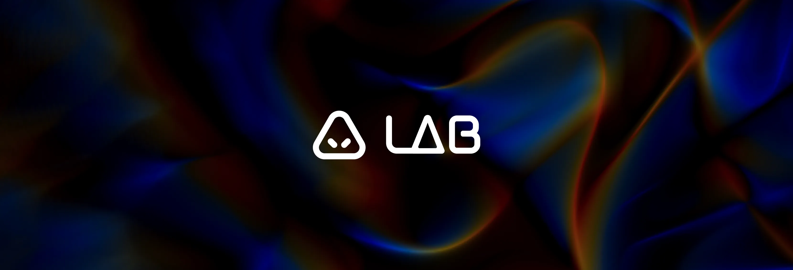

<div align="center">
  <h1>
    <a href="https://lab.kynsae.com">Kynsae - LAB</a>
  </h1>
</div>

Collection of creative experiments and interactive demos — WebGL, Three.js, 3D point clouds, and generative visuals.

## Table of Contents
- [Project Structure](#project-structure)
- [Getting Started](#getting-started)
- [Contributing](#contributing)
- [Trademarks](#trademarks)
- [License](#license)

## Project Structure

- **`public/`** — Static assets (images, fonts, icons, experiment previews).
- **`src/app/core/`** — Shared data and services.
- **`src/app/experiments/`** — One component per experiment.
- **`src/app/shared/`** — Reusable components, layout (navbar, panel), and models.

## Getting Started

**Prerequisites:**
- Node.js
- Angular CLI

**Install dependencies:**
```bash
npm install
```

**Run the dev server:**
```bash
npm start
```

**Build for production:**
```bash
npm run build
```

## Contributing
Contributions are welcome. Please open an issue to discuss proposals or bugs, and submit a pull request for changes. Keep PRs focused, include a clear description of the change and why it is needed, and run tests when applicable.

## Trademarks
IRIS, Antidote, and related logos are trademarks. The AGPL-3.0 license does not grant permission to use the trademarks for branding or marketing. See `TRADEMARKS.md` for details.

## License
This project is licensed under the **GNU Affero General Public License v3.0** (AGPL-3.0). You may use, modify, and distribute the code under the terms of that license; derivative works and network use must be disclosed and licensed under the same terms. See [LICENSE](LICENSE) in the repository root for the full text.
